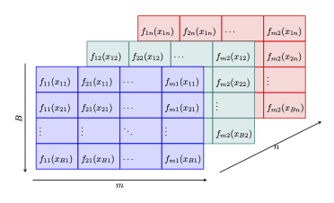

.. _background:

Kolmogorov–Arnold Representation Theorem
****************************************

The Kolmogorov-Arnold Representation Theorem is a fundamental result in the field of functional analysis and approximation theory. 
It addresses the problem of representing multivariate continuous functions using compositions of univariate continuous functions. 

.. admonition:: Theorem — Kolmogorov-Arnold Representation Theorem

    For any continuous function :math:`f: [0,1]^n \to \mathbb{R}`, there exist continuous functions :math:`\phi_{q}: \mathbb{R} \to \mathbb{R}` and :math:`\psi_{q,p}: [0,1] \to \mathbb{R}` such that:

    .. math::
        :nowrap:

        \begin{equation}
        f(\mathbf{x}) = \sum_{q=1}^{2n+1} \phi_{q} \left( \sum_{p=1}^{n} \psi_{q,p}(x_p) \right)
        \end{equation}

    where :math:`\mathbf{x} = (x_1, x_2, \ldots, x_n)`.

The inner functions :math:`\psi_{q,p}: [0,1] \to \mathbb{R}` serve to transform each component of the input vector :math:`\mathbf{x} = (x_1, x_2, \dots, x_n)` into new univariate values. The exact mathematical form of :math:`\psi_{q,p}` is not explicitly defined by the theorem; the essential requirement is their continuity.

The outer functions :math:`\phi_{q}: \mathbb{R} \to \mathbb{R}` take as input the linear combinations of the outputs of the inner functions. They map these summed values into the final contributions to the output of :math:`f`. Again, the exact mathematical form of :math:`\phi_{q}` is not explicitly give; the essential requirement is continuity.

Kolmogorov-Arnold Network (KAN) Layers
****************************************

For now, let us assume we are equipped with a set of continous univariate functions :math:`f_{i, j}: [0,1] \to \mathbb{R}` where :math:`1 \leq i \leq m` and :math:`1 \leq j \leq n`.

Given a mode-2 tensor  :math:`\mathbf{x} \in \mathbb{R}^{B \times n}`, we can define the following:

.. admonition:: Definition — Alternant tensor

    For a given set of univariate continous functions :math:`f_{i, j}: [0,1] \to \mathbb{R}` and a mode-2 tensor  :math:`\mathbf{x} \in \mathbb{R}^{B \times n}`, 
    the mode-3 alternant tensor :math:`A[f_{i, j}](\mathbf{x}) \in \mathbb{R}^{B \times m \times n}` is defined by

    .. math::
        :nowrap:

        \begin{equation}
        A[f_{i, j}](\mathbf{x}) = A_{b,i,j} = f_{i,j}(x_{b,j})
        \end{equation}

    where :math:`1 \leq i \leq m` and :math:`1 \leq j \leq n`.

An alternant tensor is simply formed by applying the given list of functions :math:`f_{i, j}` pointwise to the elements in each batch :math:`b` of :math:`\mathbf{x}`:

The notion of a Kolmogorov-Arnold Netork (KAN) layer can now easily be expressed as a contraction of an alternant tensor:

.. admonition:: Definition — KAN layer

    A KAN layer with :math:`n`-dimensional input :math:`\mathbf{x} \in \mathbb{R}^{B \times n}` and 
    :math:`m`-dimensional output :math:`\mathbf{y} \in \mathbb{R}^{B \times m}` is defined as

    .. math::
        :nowrap:

        \begin{equation}
        \mathtt{KAN}(\mathbf{x} \mid n,m) 
        = \sum_{j} A[f_{i, j}](\mathbf{x})
        = \sum_{j} f_{i,j}(x_{b,j})
        = \mathbf{y}
        \end{equation}
    
    where we assume existence and continuity of the functions :math:`f_{i, j}: [0,1] \to \mathbb{R}`.

The original Kolmogorov-Arnold representation can now be rewritten as network consisting of a KAN layer with 
:math:`n`-dimensional input and :math:`(2n +1)`-dimensional output, followed
by a KAN layer with :math:`(2n + 1)`-dimensional input and :math:`1`-dimensional output.

.. admonition:: Observation

    .. math::
        :nowrap:

        \begin{eqnarray}
            && \mathtt{KAN}(\mathtt{KAN}(\mathbf{x} \mid n, 2n+1)\mid 2n+1, 1)  \\
            &=& \mathtt{KAN}(\mathtt{KAN}( x_{b,j} \mid n, 2n+1)\mid 2n+1, 1) \\
            &=& \mathtt{KAN}( \sum_{1 \leq j \leq n} \psi_{i,j}(x_{b,j}) \mid 2n+1, 1) \\
            &=& \sum_{i=1}^{2n+1} \phi_{1,i} \left( \sum_{j=1}^{n} \psi_{i,j}(x_{b,j}) \right)
        \end{eqnarray}

Until here, we assumed existence and continuity of univariate functions :math:`f_{i, j}: [0,1] \to \mathbb{R}` available within each KAN layer. 
In what follows, we will provide several techniques to make these functions actually trainable.

Polynomial KAN Layers
****************************************

..
    As stated previously, a KAN layer is given as 

    .. math::
        :nowrap:

        \begin{equation}
        \mathtt{KAN}(\mathbf{x} \mid n, m) 
        = \sum_{j} A[f_{i, j}](\mathbf{x})
        \end{equation}

    and we simply assumed existence and continuity of the univariate functions :math:`f_{i, j}: [0,1] \to \mathbb{R}`.

Recalling the 

.. admonition:: Theorem — Weierstrass Approximation Theorem

    Let :math:`f: [a, b] \to \mathbb{R}` be a continuous function on a closed interval :math:`[a, b]`. For every :math:`\epsilon > 0`, there exists a polynomial :math:`P` such that :math:`\sup_{x \in [a, b]} |f(x) - P(x)| < \epsilon`.

it comes natural to ask whether we can find functions :math:`f_{i, j}: [0,1] \to \mathbb{R}` within the

.. admonition:: Definition — Vector space of polynomials 
    
    Let :math:`k` be a non-negative integer, 
    :math:`B = \{b_{0 \leq i \leq k}(x) \mid deg(b_{i}(x)) = i\}` be a basis of linearly independent polynomials. 
    The vector space :math:`\mathbb{P}_{k}[B]` spanned by this basis is defined as:

    .. math::

        \mathbb{P}_{k} [B] = \left\{ p(x) \mid p(x) = \sum_{i=0}^{k} a_i b_i(x), \, a_i \in \mathbb{R}, b_{i}(x) \in B \right\}

    where :math:`a_i \in \mathbb{R}` are the polynomial coefficients.

To answer this question, we require the notation of a Pseudo-Vandermonde tensor:

.. admonition:: Definition — Pseudo-Vandermonde tensor

    Given a basis of linearly independent polynomials :math:`B = \{b_{0 \leq d \leq k}(x) \mid deg(b_{d}(x)) = d\}` 
    and a mode-2 tensor :math:`\mathbf{x} \in \mathbb{R}^{B \times n}`, 
    we define the mode-3 Pseudo-Vandermonde tensor :math:`V[B](x) \in \mathbb{R}^{B \times n \times k}` as follows:

    .. math::

        V[B](x) = V_{b,j,d} = b_{d}(x_{b,j}) 

In essence, the Pseudo-Vandermonde evaluates each basis polynomial in :math:`B` for each element in :math:`\mathbf{x}`.

Using an additional, *trainable* mode-3 tensor, we can define the polynomial alternant tensor as follows.

.. admonition:: Definition — Polynomial alternant tensor

    Given a basis of linearly independent polynomials :math:`B = \{b_{0 \leq d \leq k}(x) \mid deg(b_{d}(x)) = d\}` 
    a mode-2 tensor :math:`\mathbf{x} \in \mathbb{R}^{B \times n}`, 
    and a *trainable* mode-3 tensor :math:`\mathbf{\alpha} \in \mathbb{R}^{n \times k \times m}`,
    the polynomial alternant tensor :math:`A[B](\mathbf{x}) \in \mathtt{R}^{B \times m \times n}` with respect to basis :math:`B` is defined as

    .. math::
        :nowrap:

        \begin{equation}
        A[B](\mathbf{x}) = \sum_{1 \leq d \leq k} ( \mathbf{\alpha} \cdot V[B](x) ) = \sum_{1 \leq d \leq k} (\alpha_{i,d,j} b_{d}(x_{b,j})) = f_{i,j}(x_{b,j})
        \end{equation}

The notion of a polynomial Kolmogorov-Arnold Netork (KAN) layer can now easily be expressed as a contraction of its alternant tensor.

.. admonition:: Definition — Polynomial KAN layer

    A polynomial KAN layer with :math:`n`-dimensional inputs, 
    :math:`m`-dimensional outputs and a polynomial basis :math:`B = \{b_{d}(x) \mid deg(b_{d}(x)) = d\}` is defined as

    .. math::
        :nowrap:

        \begin{equation}
        \mathtt{PolyKAN}(\mathbf{x} \mid n, m, B) 
        = \sum_{j} A[B](\mathbf{x})
        = \sum_{j} \sum_{d} (\alpha_{i,d,j} b_{d}(x_{b,j}))
        \end{equation}

    where :math:`A[B](\mathbf{x})` is the polynomial alternant tensor with respect to basis :math:`B`.

A note on parametric polynomial bases
======================================

Several polynomial bases are in fact families of polynomials, i.e. the respective basis polynomials depend on a number of parameters.

For example, the Askey-Wilson polynomials are a four-parameter family of orthogonal polynomials defined as follows:

.. math::

    p_n(x; a, b, c, d \mid q) = a^{-n} (ab, ac, ad; q)_n \ {}_4\phi_3 \left( \begin{matrix}
    q^{-n}, abcdq^{n-1}, ae^{i\theta}, ae^{-i\theta} \\
    ab, ac, ad \end{matrix} \mid q; q \right), \quad  x = \cos(\theta)

.. note::
    As per default, :math:`\texttt{ARNOLD}` will handle all parameters as additional *trainable* variables.

In case you would like to change these defaults, you can do so when instantiating your KAN layer:

.. automethod:: arnold.layers.core.polynomial.orthogonal.AskeyWilson.__init__
    :no-index:

Implicit Tucker decomposition
================================

Each polynomial KAN layer requires :math:`m \times n \times k` parameters to learn the polynomial coefficients :math:`a_{i,d,j}` of 

.. math::
    
    \begin{equation}f_{i,j}(x_{b,j}) =  \sum_{0 \leq d \leq k} a_{i,d,j} b_{d}(x_{b,j})\end{equation}

We support the *implicit* Tucker decomposition of the *trainable* mode-3 tensor :math:`\mathbf{\alpha} \in \mathbb{R}^{n \times k \times m}` into 

* a *trainable* mode-3 core tensor :math:`C \in \mathbb{R}^{r_1 \times r_2 \times r_3}`,
* a *trainable* mode-2 tensor :math:`U_1 \in \mathbb{R}^{r_1 \times n}`, 
* a *trainable* mode-2 tensor :math:`U_2 \in \mathbb{R}^{r_2 \times k}`, and 
* a *trainable* mode-2 tensor :math:`U_3 \in \mathbb{R}^{r_3 \times m}`

such that 

.. math::
    \mathbf{\alpha}  = C \times U_1 \times U_2 \times U_3

With appropriate choices of :math:`r_1, r_2, r_3 \in \mathbb{N}_{+}`, 
the number of parameters of :math:`\mathtt{PolyKAN}(\mathbf{x} \mid n, m, B)` can be reduced from 

.. math::
    
    m \times n \times k

to 

.. math::
    
    (r_1 \times r_2 \times r_3) + (r_1 \times n) + (r_2 \times k) + (r_3 \times m)

A common choice is :math:`r_1 = r_2 = r_3 = \min(m,n,k)` which can be effective when the difference in dimension sizes is large.

