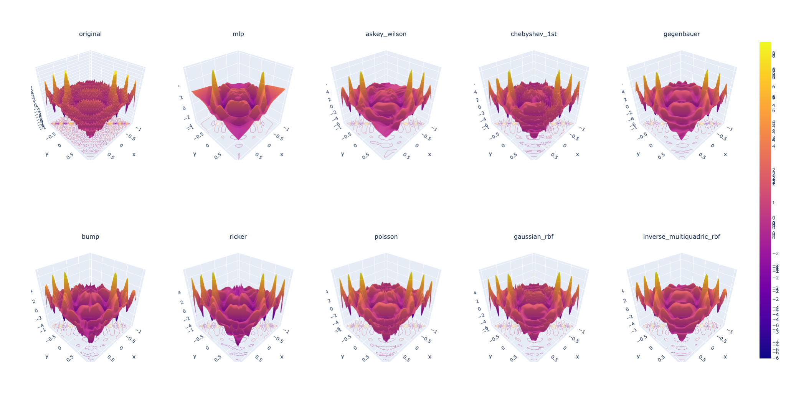

# Multivariate Interpolation

| Model                     | Trainable parameters | 
| :-                        | :-                   | 
| mlp                       | 528385               | 
| askey_wilson              | 3796                 | 
| chebyshev_1st             | 3776                 | 
| gegenbauer                | 3780                 | 
| bump                      | 2176                 | 
| ricker                    | 2176                 | 
| poisson                   | 2176                 | 
| gaussian_rbf              | 5616                 | 
| inverse_multiquadric_rbf  | 5616                 | 

