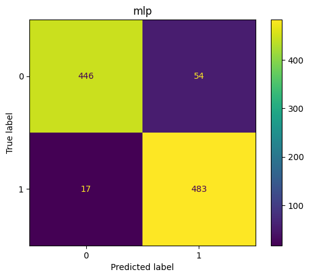
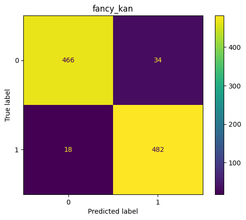

# Two Moons: Binary classification 

[]()

We compose a KAN of a polynomial `Chebyshev1st` layer, a polynomial `Legendre` layer and a `Bump` wavelet layer and compare against a standard MLP using the "Two Moons" dataset.


```python
all_models = {
    # 2751 trainable parameters
    'mlp': tfk.Sequential([
            tfkl.Dense(50, activation="relu"),
            tfkl.Dense(50, activation="relu"),
            tfkl.Dense(1, activation="sigmoid")
        ],
        name='mlp'
    ),
    # 286 trainable parameters
    'fancy_kan': tfk.Sequential([
            Chebyshev1st(input_dim=2, output_dim=8, degree=2),
            tfkl.LayerNormalization(),
            Legendre(input_dim=8, output_dim=6, degree=3),
            tfkl.LayerNormalization(),
            Bump(input_dim=6, output_dim=1),
            tfkl.Activation(tfk.activations.sigmoid)
        ],
        name="fancy_kan" 
    )
}

for name, model in tqdm(all_models.items()):
    model.build((None, 2))
    model.compile(
        optimizer=tf.keras.optimizers.legacy.Adam(),
        loss='binary_crossentropy',
        metrics=['binary_accuracy']
    model.fit(
        x_train,
        np.reshape(y_train, (-1,1)),
        epochs=EPOCHS, 
        shuffle=True,
        verbose=0,
    )
```
Note that `fancy_kan` model (286 trainable parameters) is slightly more parameter-efficient than the `mlp` model (2751 trainable parameters).


